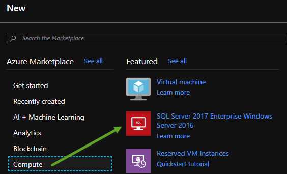
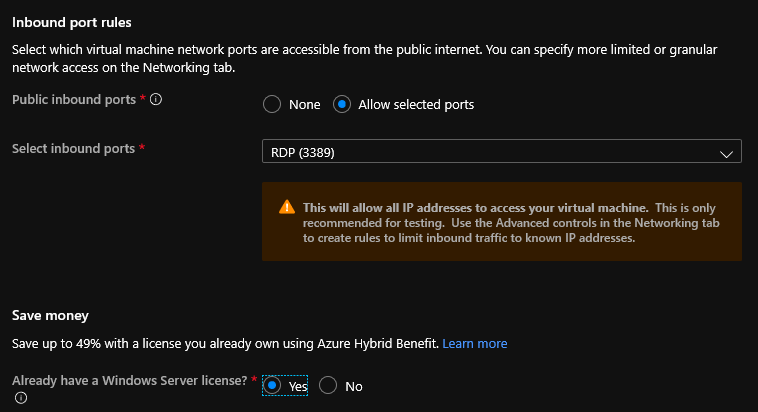
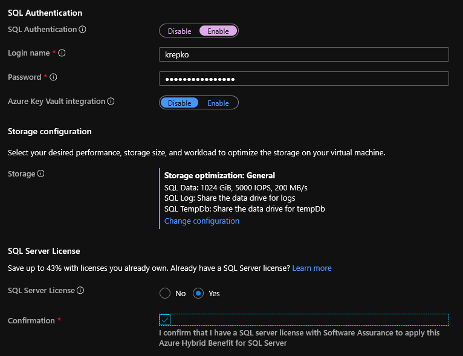
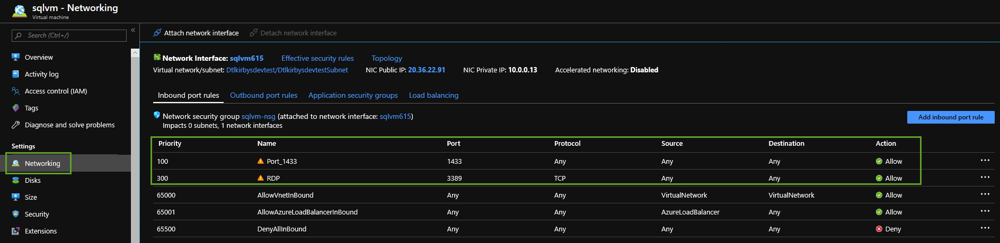

## Azure Data Factory (ADF) 
# Lab 0 - Set up

Restore the Retail database to a SQL Server on a VM in Azure.  
Use the .bak file in this directory.

If you need to create a VM with SQL from scratch go to the Azure Portal, click the green plus to create a resource and
pick an image like show below.

Make sure to enble RDP port 3389 and SQL 1433 and save money by clicking the Yes option for Windows server.s

Under the SQL Server Settings tab pick something similar to below including enabling SQL Authentication.

Once the VM is ready go to it and pick the Networking menu item on left to confirm your RDP and SQL ports are open.

Restore the .bak file to the database.

# Here are some links for Azure Data Factory best practices 

- [ADF Best Practices blog](https://blog.coeo.com/craigparsons/2017/04/21/azure-data-factory-best-practices-part-1)
- [Security Considerations for data movement in data factory](https://docs.microsoft.com/en-us/azure/data-factory/data-movement-security-considerations)
