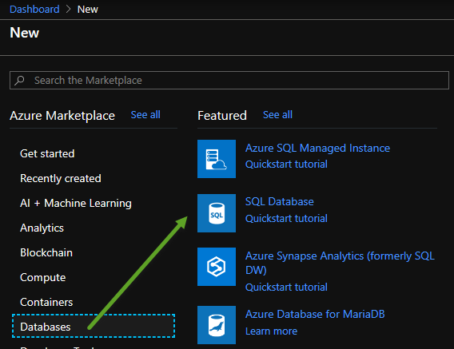
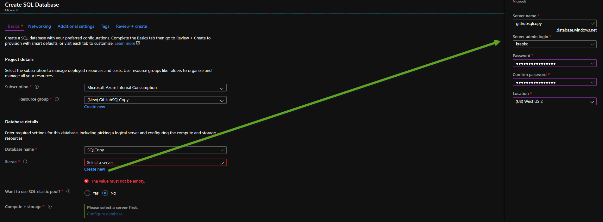
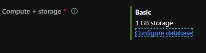
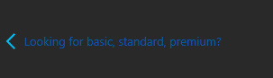
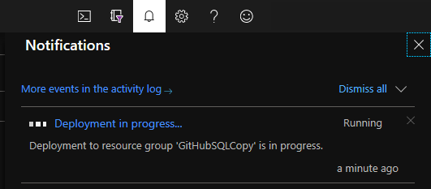

## Copy data from SQL VM to SQL Paas
# Lab 2 - Set up Azure SQL Database

Create an Azure SQL Database (Paas).  Go to portal.azure.com and click the Create Resource menu item from top left menu.

Then pick the Databases category and then click on SQL Database. 

Fill in fields for the first screen similar to below.

Click the Configure Database link.

Click the "Looking for basic, standard, premium?" link at the top left.

From here you can pick a configuration that is less than $10 per month and click the Apply button.
Click the Review and Create button and after reviewing click the Create button.

Watch the bell icon at the top right of your screen and click it to see the deployment progress of your SQL DB 
or click it when finished to go to the newly set up SQL DB.

