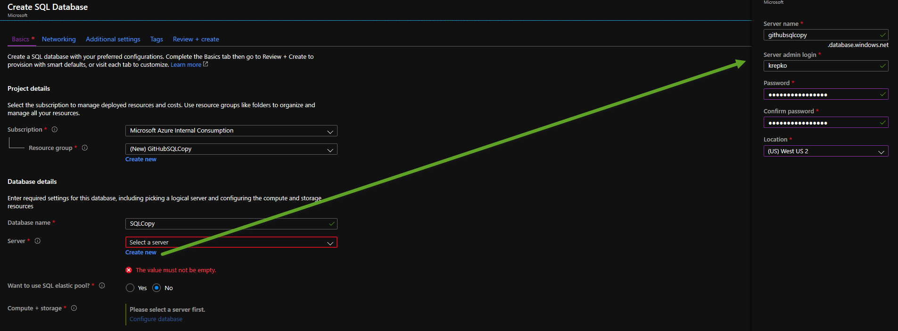
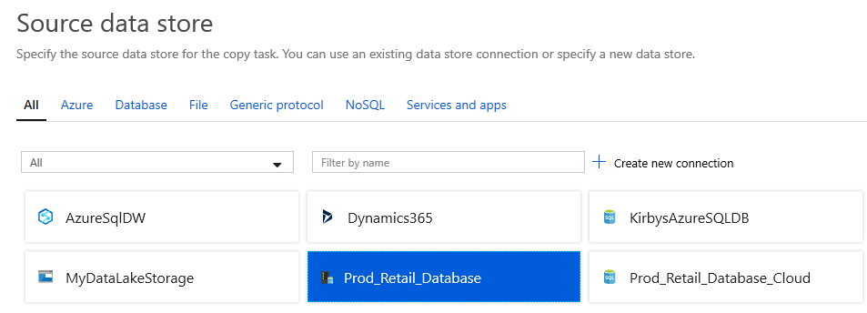
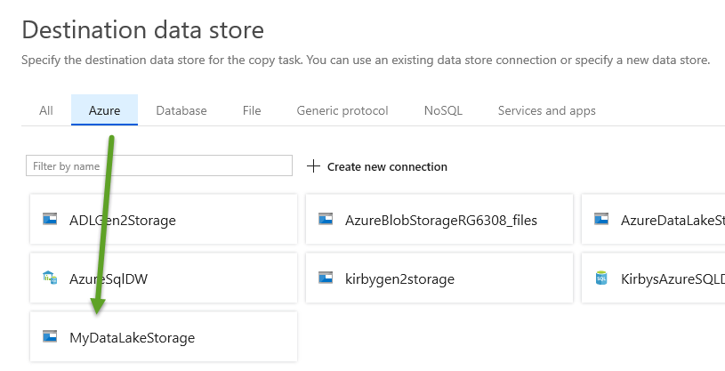

## Copy data from SQL VM to SQL Paas
# Lab 2 - Set up Azure SQL Database and a Data Factory connection to it

Create an Azure SQL Database (Paas).  Go to portal.azure.com and click the Create Resource menu item from top left menu.

Then pick the Databases category and then click on SQL Database. 

Fill in fields for the first screen similar to below.

Click the Configure Database link.

Click the "Looking for basic, standard, premium?" link at the top left.

From here you can pick a configuration that is less than $10 per month and click the Apply button.
Click the Review and Create button and after reviewing click the Create button.

Now go back to Data Factory, click the Author item and then click the bottom left Connections menu.
Create a new Linked Service for your data lake.

Click the ellipses next to Pipelines and create a new folder to keep things organized

Then click the ellipses next to Pipelines and pick the Copy Data option

When working in a wizard like the Copy Wizard or creating pipelines from scratch make sure to give a good name to each
pipeline, linked service, data set and other componenets so it will be easier to work with later. 

For your source pick the Database section filter at top and pick the SQL Server Connection you created earlier.

Pick your source table Person.Person and click Next.

Now pick your data lake destination you created earlie.

Pick the folder you created earlier in Data Lake storage using the browse button and give an appropriate file name and click next.

Click your desired file format settings and click next.

Click next, review settings and make any changes you desire and then click next again and then you should see a screen like this:

Now click the Monitor button to see your pipeline\job running.
You should see a screen similar to below.  If you don't see your job\pipeline check your filters on the top right.

Optionally go to Azure Storage Explorer, sign into your Azure account and view the file(s) in your storage account.s

