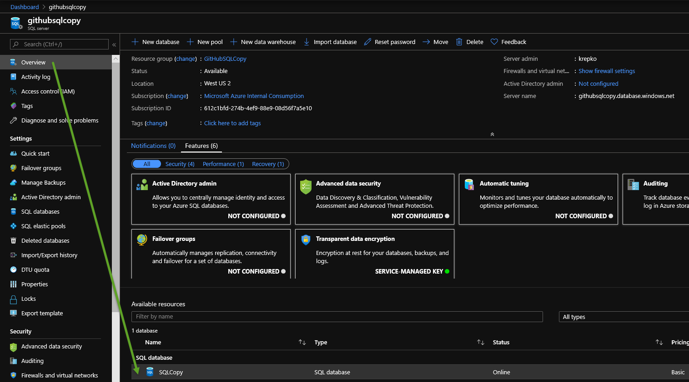
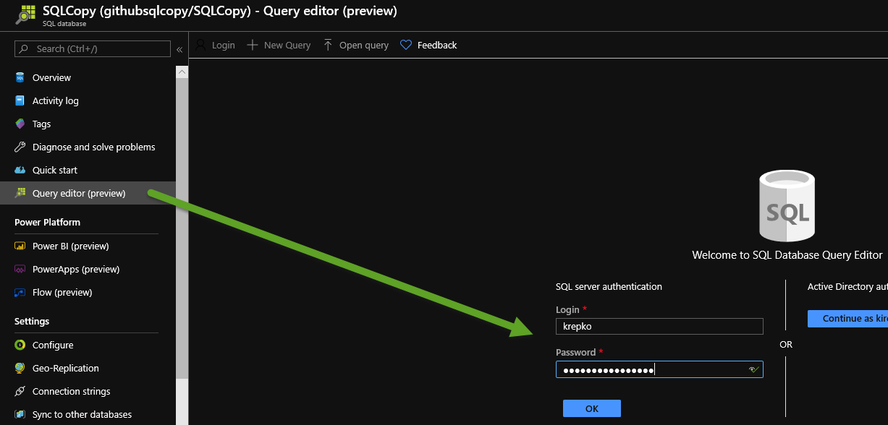
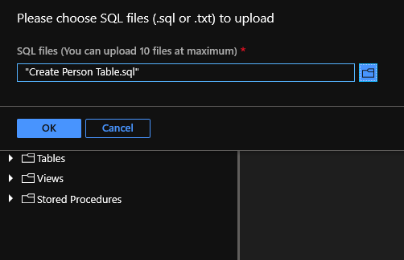
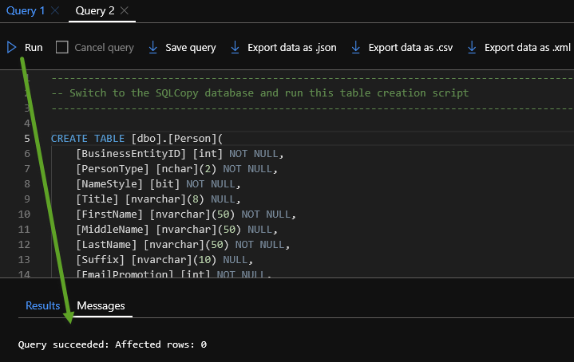

## Copy data from SQL VM to SQL Paas
# Lab 3 - Create Azure SQL DB destination table

Go to the Azure Portal and pick the Azure SQL DB SQL Server you set up earlier.  

If you can't find something in Azure simply go to the top search box in the Azure portal and type what you are looking for. 
For example, the below screen shot shows me looking for my "SQL Servers".  You will see a list of services below that pop up
and you can click on the one you want. 

Once you are in the SQL Server click on the SQL Database like the image shows below.  You are looking for the "SQLCopy" database
you created earlier.

Now click the Query editor and log in with your SQL Auth credentials which are the admin ID and password you used to set up the
Azure DB earlier. 

You have a couple choices to get the SQL script to create the destination table.  Either open the "Create Person Table.SQL" in GitHub 
and copy and paste into the Query editor or you can copy the file locally to your laptop and then open it in the query editor like show here:

Finally run the query and your Person table should be created.  Check the query messages below your SQL to make sure it ran successfully. 
You can also expand the Tables folder to the left of the query editor to see if the table now exists.

