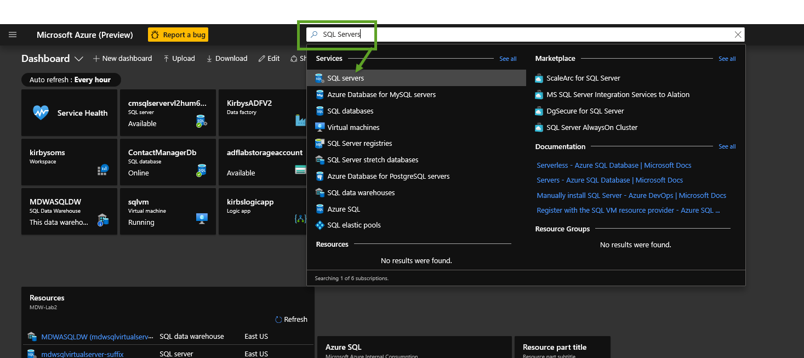

## Copy data from SQL VM to SQL Paas
# Lab 3 - Create Azure SQL DB destination table

Go to the Azure Portal and pick the Azure SQL DB SQL Server you set up earlier.  

If you can't find something in Azure simply go to the top search box in the Azure portal and type what you are looking for. 
For example, the below screen shot shows me looking for my "SQL Servers".  You will see a list of services below that pop up
and you can click on the one you want. 

Once you are in the SQL Server click on the SQL Database like the image shows below.  You are looking for the "SQLCopy" database
you created earlier.

