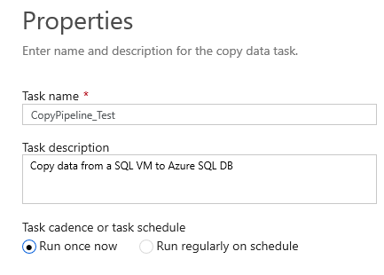
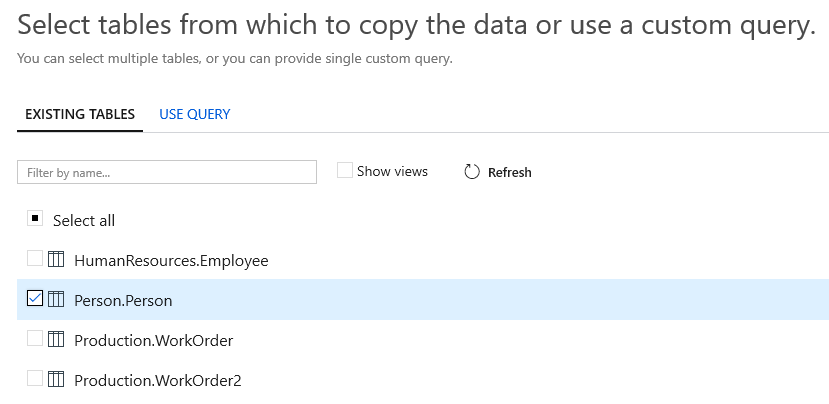
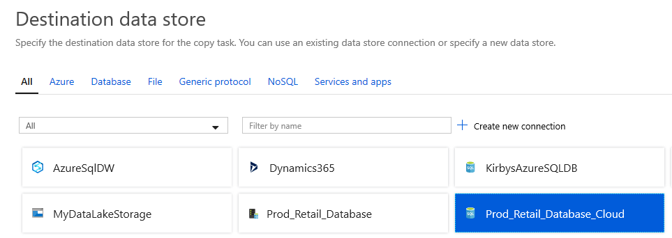
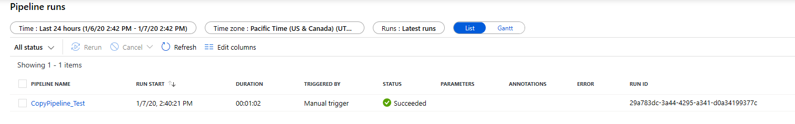

## Copy data from SQL VM to SQL Paas
# Lab 3 - Incremental Table Copy - Set up SQL table

Go back to Data Factory, click the Author item and then click the bottom left Connections menu.
Create a new Linked Service for your Azure SQL DB you created earlier. Use the Azure SQL DB admin ID and password 
you used in the earlier lab when you set up the Azure SQL DB.

Click the create button.

Now in Azure Data Factory click the ellipses next to Pipelines and create a new folder to keep things organized.
Call the folder anything you like.  Example "Data Factory Lab".

Click the plus icon to the right of the "Filter resources by name" input box and pick the Copy Data option.

When working in a wizard like the Copy Wizard or creating pipelines from scratch make sure to give a good name to each
pipeline, linked service, data set and other componenets so it will be easier to work with later. 

Click next and pick the Person.Person table.

Click next twice and then for your destination pick the Azure SQL DB connection you created earlier and click next.

Then pick the person table as the destination and leave the default column mapping and click next a few times until 
you come to the screen that says Deployment Complete.

Now click the Monitor button to see your pipeline\job running.
You should see a screen similar to below.  If you don't see your job\pipeline check your filters on the top right.

