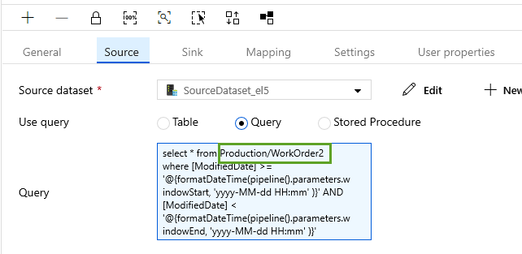

## Azure Data Factory (ADF) 
# Lab 4 - Incremental Table Copy - Set up SQL table

In this lab we will set up a pipeline to incrementally copy data from a SQL table based
on a datetime column.  This first lab sets up table with a trigger to populate the datetime column.

#### Connect to your SQL Server VM and look at and run the code in the "Set Up Table.sql" file 

#### In data factory click the plus sign just below Factory Resources and pick the Copy Data option.

#### Fill in a good and and description of the pipeline. Make sure to pick the Regularly on schedule option and click Next.

#### Pick your source connection and click Next. 

#### Pick the table you want to copy from and click Next. 

#### Add the filter to the date time column you created. Click Next.

#### Click the Azure data lake storage connection and click Next. 

#### Pick the folder and give it a file name.  We can change the file name to be dynamic later.  Click Next.

#### Click Next two more times and leave the settings at their defaults. 

#### You should now see a deployment screen like below.  Click the Finish button.  We will manually trigger the job next.

#### You may need to do one fix to the auto generated code.  Go to the Source of your copy activity and change the SQL to be "Database.TableName" instead of "Database/TableName".

#### In the pipeline click the Trigger option at the top and then enter date parameters and click Finish.

#### You can now monitor your job. 

# Alternative method
- [Use the High Watermark delta method described here.](https://docs.microsoft.com/en-us/azure/data-factory/solution-template-delta-copy-with-control-table)

